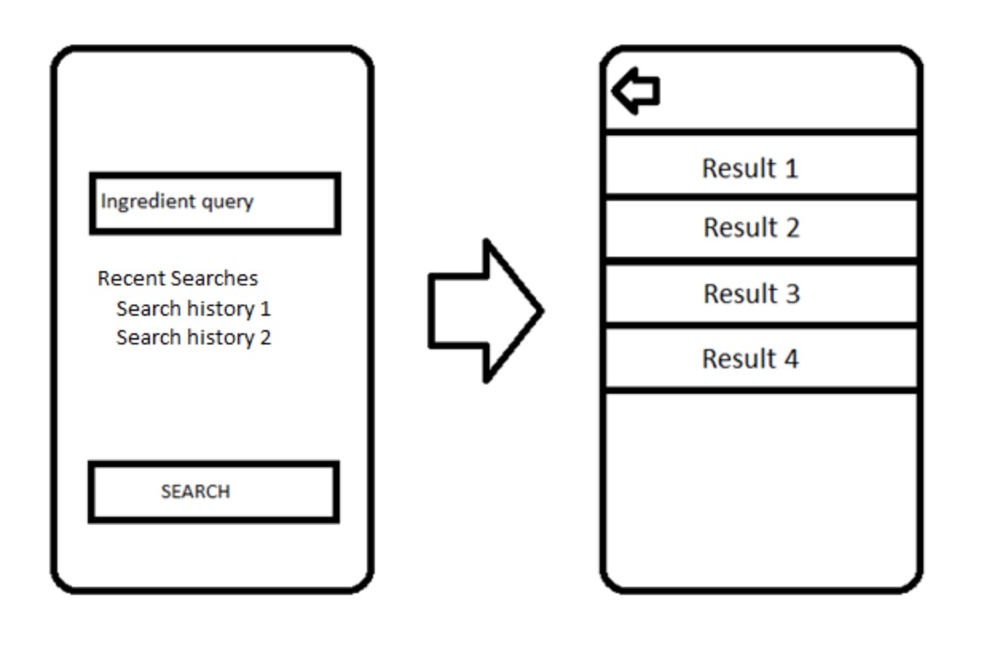
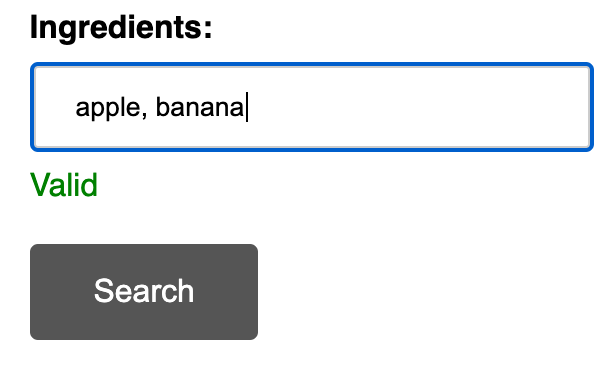
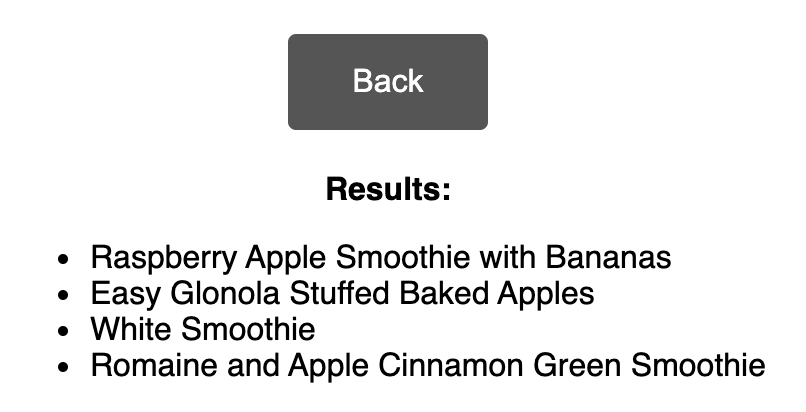

## URL

[https://recipe-app-val-alex.vercel.app/](-val-alex.vercel.app/)

## Tech Stack

I decided to update this test app for modern times :)

- React.js
- Next.js
- Redux Toolkit + RTK Query
- React Hook Form
- Styled Components
- Material UI
- Jest

## App description

Using React + Redux, create a simple single page application with 2 views, displaying a list of items retrieved from a public api ( https://spoonacular.com/food-api/docs )

(Wireframe for application)

Pass the ingredients from the Ingredient Query text field to the findByIngredients api. On success, it should display the results on the next screen. Selecting a result should expand the result.
This is a small application so gives an opportunity to demonstrate your technical abilities, development approach and initiative to interpret rough draft requirements.

## Spoonacular API reference

Sign-up to spoonacular for a free public api and find your API key at https://spoonacular.com/food-api/console#Profile
Documentation on authentication with your API key https://spoonacular.com/food-api/docs#Authentication
Documentation for the findByIngredients endpoint https://spoonacular.com/food-api/docs#Search-Recipes-by-Ingredients

## Use

This app helps you to find recipes for ingredients you have available

(Add ingredients you have separated by comma and click search)

(App displays list of recipes that you can make for given ingredients )

## Available Scripts

`npm run dev`  
`npm run build`  
`npm run export`  
`npm run start`  
`npm run test`  
`npm run test:ci`
